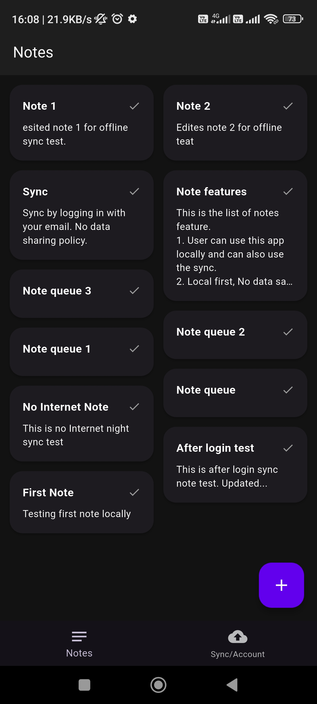
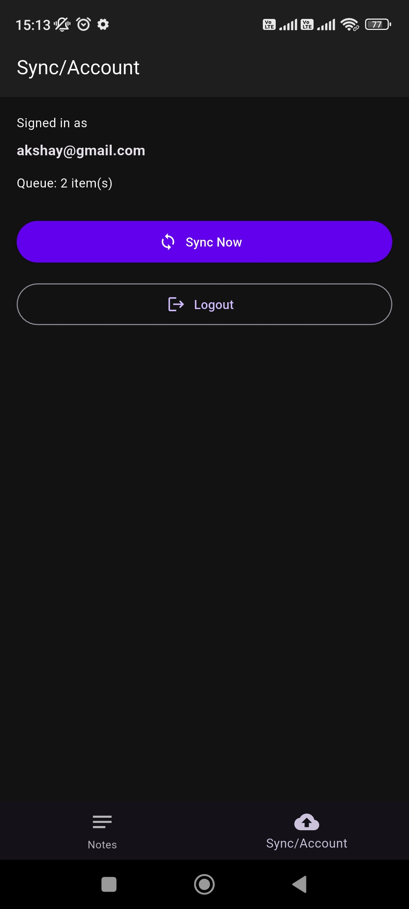

# re_note

Offline-first sync queue note app

---

## Getting Started

Follow these steps to get a local copy of the project up and running.  
You can also download the apk [click here to download the apk](https://drive.usercontent.google.com/download?id=1kpq5QCxY0r9CF7sBAAetsJVlXZwfaNBv&export=download)

### Prerequisites

* **Flutter SDK:** Ensure you have the Flutter SDK installed. [Installation Guide](https://docs.flutter.dev/install)
* **Dart SDK:** Usually bundled with Flutter.
* **IDE:** VS Code (recommended), Android Studio, etc.

### Setup and Installation

1.  **Clone the repository**
    ```bash
    git clone https://github.com/akshay-maurya/re_note.git
    cd re_note
    ```

2.  **Install dependencies** Run this command in the root directory to fetch all the required packages:
    ```bash
    flutter pub get
    ```

3.  **Check for issues** Verify that your environment is correctly set up and your device is connected:
    ```bash
    flutter doctor
    ```

4.  **Run the application** You can run the app in debug mode using:
    ```bash
    flutter run
    ```

5. **Login to the application** You can login/register in the app:
    ```
    If you don't want to register to the app use the below credential to sign-in to the app for testing sync feature.
   email: akshay@gmail.com
   password: Akshay@123
    ```

---
## Screenshots





---

## Technical Approach

### 1. Architectural Pattern: Local-First with Remote Mirror
The app follows a **Local-First philosophy**. All user actions (Create, Read, Update, Delete) are performed immediately on the local Hive database to ensure sub-1ms latency and offline availability. A background **Sync Engine** then works to make the Firestore backend mirror the local state.

### 2. The Sync Engine (Queue & Durability)

- **Idempotency:**  
  Each note is assigned a client-side UUID. Using Firestore's `.set(merge: true)` with this ID ensures that retries do not create duplicate notes.

- **Connectivity Awareness:**  
  The app utilizes `connectivity_plus` to listen for network changes. When the device transitions from offline to online, a sync is automatically triggered.

- **Conflict Resolution:**  
  I implemented a **Last-Write-Wins (LWW)** strategy using an `updatedAt` timestamp. This provides a consistent "Source of Truth" without the complexity.

### 3. Authentication & Security

- **Auth-Gated Sync:**  
  To prevent data loss and ensure privacy, syncing is only enabled once a user authenticates via Firebase.

- **Data Reconciliation:**  
  Upon first login, the app performs a "Handshake" where local Hive notes are merged with existing cloud data based on the most recent timestamps.

---

## Tradeoffs

| Feature            | Choice                  | Reason |
|------------------|------------------------|--------|
| State Management  | Provider               | Chosen for its simplicity and efficiency in managing a unified sync state and UI reactivity |
| Local Database    | Hive                   | Chosen over SQLite for its superior speed and ease of storing JSON-like Note objects without complex migrations |
| Sync Strategy     | Full Document Upsert   | Instead of Delta-syncing (diffs), I sync the entire note. This reduces logic complexity and is efficient for text-heavy data |
| Auth Model        | Explicit Login         | Traded "Zero-friction Anonymous Auth" for "Durable Account-based Auth" to ensure users don't lose data upon app uninstallation |

---

## ⚠️ Limitations

- **Real-time Multi-device Collision:**  
  While LWW handles most cases, if two devices edit the exact same note at the exact same millisecond, one set of changes will be overwritten.

- **Large Attachments:**  
  Currently optimized for text. Handling images or large files would require implementing a chunked upload strategy via Firebase Storage.

---

## Next Steps (Future Improvements)

- **Exponential Backoff:**  
  Improve retry logic to wait progressively longer (5s, 10s, 30s) after consecutive failures to reduce server load and battery drain.

- **Folders & Labels:**  
  Extend the Hive schema to support categorizing notes and test sync engine handling of relational data.

- **Encrypted Local Storage:**  
  Use Hive's encrypted box feature to secure notes stored on the device.

- **Unit Testing for Sync Logic:**  
  Add rigorous tests for the `reconcileData` function to simulate various "Cloud vs. Local" timestamp conflicts.

---

## AI Prompt Log

### Note: I have simplified the prompting, accepted and rejected logs too keep it engaging, short and simple.

### Initial prompt
I am building a Google Keep Clone in Flutter. The primary focus is an Offline-first Sync Queue.
The Requirements:
1. Model: Create a Note model with id (String UUID), title, content, isSynced (bool), and updatedAt.
2. Local Storage: Use Hive to persist notes. When a user creates/edits a note, it must save to Hive immediately with isSynced = false.
3. Sync Manager: Create a SyncProvider (using Provider) that listens to connectivity changes. When online, it should iterate through all isSynced = false notes in Hive and 'push' them to a mock API/Firebase.
4. Idempotency: Ensure the id generated on the phone is used as the document ID on the server to prevent duplicates during retries.
5. UI Component: A NoteTile widget that shows a 'Syncing' spinner or a 'Cloud-off' icon if the note is only stored locally.
6. Conflict Handling: Use Last-Write-Wins. Use the updatedAt timestamp to decide.
   Please provide the Note model with Hive adapters and the SyncProvider logic that handles the background queue processing."

```
Accepted: Given hive model for local storage, SyncProvider logic, SyncManager logic.
Denied: MockApi model and hardcoded mock api models as I am planning use the firebase_store for data syncing.
```

### Second Prompt
"Now that we have the Note model and Hive setup, let's build the Sync Engine.
1. Connectivity Listener: Integrate the connectivity_plus package. Create a service that listens to network changes. When the device comes back online, it should automatically trigger the sync queue.
2. Process Queue: Create a function processFullQueue() that:
    * Filters Hive for all notes where isSynced == false.
    * Attempts to upload them one by one to the backend.
    * Updates the note in Hive to isSynced = true only AFTER a successful server response.
3. Retry Logic + Backoff: If an upload fails (e.g., a 500 error or timeout), implement a single retry with a 5-second delay.
4. Idempotency Logic: Ensure the sync function uses the Note's id as the primary key for the remote database (Upsert operation) so that multiple retries don't create duplicate notes.
5. Observability: Create a SyncStatus stream or state that the UI can listen to. It should track:
    * pendingCount: Number of notes waiting to sync.
    * isSyncing: A boolean for a global loading indicator.
    * logs: A list of strings capturing events (e.g., 'Connection restored', 'Syncing Note A...', 'Note A Synced').
      Please provide the code for the SyncManager class and how to integrate it with the existing Provider."

```
Accepted: Only adappters.
Denied: denied everything else.
```

### Third Prompt
"I need to integrate Firebase Cloud Firestore into my Flutter 'Google Keep' clone to handle the remote sync.
1. Firebase Setup: Provide a FirestoreService class with a method upsertNote(Note note). It must use instance.collection('notes').doc(note.id).set(note.toMap(), SetOptions(merge: true)) to ensure Idempotency.
2. Dependency Injection: Update the SyncProvider to take this FirestoreService as a dependency.
3. The Sync Loop: In processFullQueue(), iterate through Hive notes where isSynced == false:
    * Call upsertNote(note).
    * If successful, update the Hive object: note.isSynced = true; note.save();.
    * Wrap this in a try-catch block. If it fails, log the error and stop the loop (to prevent hitting the API repeatedly when offline).
4. Auth Mocking: Since this is a 1-day task, assume a single user. Use a hardcoded userId or a 'Guest' collection for now, but keep the code modular so Auth could be added later.
5. Error Handling: If Firebase throws a 'permission-denied' or 'network-unavailable', catch it and update a syncErrorMessage string in the Provider so the UI can show a 'Sync Failed' badge.
   Please provide the FirestoreService and the updated SyncProvider logic."

```
Accepted: All the given response.
Denied: Nothing as It already understood assignment.
```

### Fourth Prompt
"I am building the UI for my Google Keep clone with Offline-first Sync.
1. Main Screen: Create a Scaffold with a Masonry-style Grid (using flutter_staggered_grid_view or a simple GridView.builder).
2. Note Card: Each card should display the title and content. Crucially, add a small icon in the corner:
    * If note.isSynced is false, show Icons.cloud_upload_outlined (tinted orange or gray).
    * If note.isSynced is true, show no icon or a subtle checkmark.
3. Editor Screen: A simple screen to add/edit notes. When 'Save' is clicked, it should call SyncProvider.addNote(newNote).
4. Sync Status Bar: Add a small 'Syncing...' overlay or a LinearProgressIndicator at the top of the grid that only appears when SyncProvider.isSyncing is true.
5. Empty State: Handle the 'No notes yet' scenario with a nice icon and text.
6. Edge Case UI: If SyncProvider.errorMessage is not null, show a SnackBar with a 'Retry' button that manually triggers SyncProvider.processFullQueue().
   Please provide the HomeScreen and NoteEditor widgets, ensuring they listen to the SyncProvider we built earlier."

```
Accepted: All the given response.
Denied: Nothing as I am planning to improve in next prompt.
```

### Fifth Prompt
"I want to improve my Anonymous Auth logic to handle app uninstalls/reinstalls.
1. Device Identifier: Use the device_info_plus package to get a unique ID for the device on startup.
2. Metadata Mapping: When a user is first created, save a document in Firestore: /users/{uid}/metadata containing the deviceId.
3. Recovery Logic: On app startup, if the current FirebaseAuth user is new (has no notes), perform a 'Search' in the Firestore /users/ collection for any document that matches the current deviceId.
4. Data Restoration: If a matching deviceId is found from a previous installation, fetch the notes from that old UID and 'migrate' them to the current local Hive box.
5. Security Warning: Acknowledge that this is a 'Soft Recovery' and add a UI banner suggesting the user 'Sign in with Google' to permanently secure their data.
   Please provide the code for this 'Recovery Service' and how to integrate it into the initial sync flow."

```
Accepted: Model changes, device_info_plus package install and usage function, firebase_auth methods.
Denied: firebase sync on app startup which duplicates the sync as everytime the app starts it fire-up the fullProcessQueue() method which overheads the app startup.
```

### Sixth Prompt
"I am refactoring my Flutter Notes app to use a BottomNavigationBar and Firebase Auth.
1. Navigation: Create a MainScreen with a BottomNavigationBar containing two tabs: 'Notes' and 'Sync/Account'.
2. Sync Tab (Logged Out): Create a 'Cloud Sync' view with an illustration/icon, a message saying 'Login to back up your notes safely', and a 'Sign in with Google/Email' button.
3. Sync Tab (Logged In): Display the user's email and a 'Sync Now' button that manually triggers processFullQueue(). Also, include a 'Logout' button that clears the local Hive box (optional, or keep it for offline use) and signs out.
4. Auth-Gated Sync: Update the SyncProvider:
    * Add a boolean isSyncEnabled that is true only when a user is logged in.
    * Modify processFullQueue() to return immediately if currentUser == null.
    * Important: When a user logs in for the first time, trigger a reconcileData() function that merges their local Hive notes with any existing notes in their Firestore account.
5. UI Feedback: On the 'Notes' tab, if the user is NOT logged in, show a small banner or 'Cloud-off' icon at the top saying 'Sync disabled. Log in to save data.'
   Please provide the MainScreen with the Tab logic and the updated SyncProvider with the Auth listener."

```
I implemented a Hybrid Auth-State Model.
* Local-First: Users can create notes immediately without an account (stored in Hive).
* Cloud-Sync (Opt-in): Once the user logs in, the app performs a one-way migration of local notes to the cloud and thereafter maintains a bidirectional sync.
* Durability: Because notes are tied to a permanent Firebase UID, a simple login after a reinstall triggers a full restoration of the user's data from Firestore back into the local Hive storage.
```